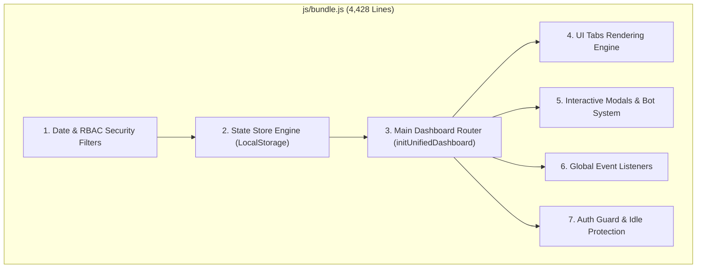
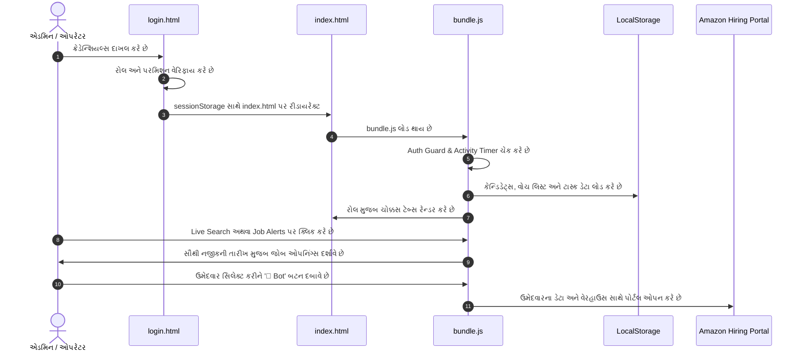

# 🏗️ Amazon Client System — Codebase Structure & Architecture Master
*(આ પ્રોજેક્ટના સંપૂર્ણ કોડબેઝનું માળખું, ફાઈલ વિશ્લેષણ અને આર્કિટેક્ચર ગાઈડ — Comprehensive Gujarati & English Architecture Documentation)*

---

## 🌐 ૧. પરિચય (Overview)

આ પ્રોજેક્ટ **Amazon Shift Booking Automation, Unified Candidate Management & Schedule Scanner System** છે.  
તે સંપૂર્ણપણે **Vanilla HTML, CSS અને Client-Side JavaScript** પર આધારિત છે. કોઈપણ ભારે બેકએન્ડ ફ્રેમવર્ક વગર સીધું જ બ્રાઉઝરમાં લાઈટવેઇટ અને સુપર ફાસ્ટ સ્પીડે ચાલે છે.

---

## 📂 ૨. પ્રોજેક્ટ ફોલ્ડર અને ફાઇલ હાયરાર્કી (Directory Tree)

```text
Amazon Job/
├── frontend/                  # [FRONTEND] UI, ક્લાયન્ટ પેજીસ અને સ્ટાઇલિંગ
│   ├── index.html             # મુખ્ય એપ્લિકેશન શેલ (Dashboard Root)
│   ├── login.html             # 3D એનિમેટેડ રોલ-બેઝ્ડ લોગિન પોર્ટલ
│   ├── css/
│   │   └── styles.css         # 49 KB ની સાયબરપંક ડાર્ક થીમ ગ્લાસમોર્ફિઝમ ડિઝાઇન સિસ્ટમ
│   └── js/
│       ├── bundle.js          # ⭐️ [મુખ્ય ઉત્પાદન ફાઇલ] Standalone પ્રોડક્શન કોડ (UI + Bot)
│       ├── app.js             # મોડ્યુલર રાઉટર અને સેશન એક્ટિવિટી ગાર્ડ
│       ├── unifiedDashboard.js # ડેશબોર્ડ ટેબ્સ અને મોડલ કંટ્રોલર્સ
│       └── publicScanner.js   # એમેઝોન શિફ્ટ અને શેડ્યુલ ID સ્કેનર
│
├── backend/                   # [BACKEND] સર્વર, ડેટા સ્ટોર અને ઓટોમેશન વર્કર
│   ├── server.js              # Node.js બેકએન્ડ સર્વર & REST API એન્ડપોઇન્ટ્સ
│   ├── state.js               # સેન્ટ્રલ સ્ટેટ મેનેજમેન્ટ અને લોકલસ્ટોરેજ સ્ટોર (RBAC)
│   ├── mockWorker.js          # બેકગ્રાઉન્ડ સિમ્યુલેશન વર્કર (IMAP OTP & Booking Simulator)
│   └── package.json           # બેકએન્ડ કન્ફિગરેશન
│
├── index.html                 # રૂટ ફોરવર્ડર (Auto-redirects to frontend/login.html)
├── login.html                 # રૂટ ફોરવર્ડર (Auto-redirects to frontend/login.html)
├── package.json               # રૂટ પ્રોજેક્ટ સ્ક્રિપ્ટ્સ (npm start)
├── README.md                  # GitHub રિપોઝિટરી મુખપૃષ્ઠ
├── CODEBASE_STRUCTURE.md      # આ ફાઇલ — સંપૂર્ણ પ્રોજેક્ટ આર્કિટેક્ચર માસ્ટર ડોક્યુમેન્ટ
├── Last Convertation.md       # સેશન હેન્ડઓવર, સ્ટેટસ અને રેઝ્યુમ્પ્શન માસ્ટર ફાઇલ
└── .gitignore                 # ગિટ ઇગ્નોર નિયમો
```

---

## 🔍 ૩. દરેક ફાઇલનું વિગતવાર વિશ્લેષણ (Detailed File Analysis)

### ૧. [index.html](file:///c:/Users/Tanis/Downloads/Projects/Amazon%20Job/index.html) — Main Dashboard Shell
- **કદ:** 37 લાઈન્સ (~1.4 KB)
- **હેતુ:** એપ્લિકેશનનું હોમપેજ (Single Page Application - SPA Container).
- **મુખ્ય ઘટકો:**
  - `div.bg-mesh-overlay`: 3D પર્સ્પેક્ટિવ ગ્રીડ મેશ બેકગ્રાઉન્ડ.
  - `div#appContainer`: તમામ ડેશબોર્ડ સ્ક્રીન્સ અને ટેબ્સ અહીં JavaScript દ્વારા રેન્ડર થાય છે.
  - `div#toastContainer`: સિસ્ટમ એલર્ટ્સ અને ટોસ્ટ નોટિફિકેશન્સ માટેનું કન્ટેનર.
  - `<script src="js/bundle.js?v=60.0"></script>`: આખી એપ્લિકેશનનું એન્જિન આ એક જ ફાઇલમાંથી લોડ થાય છે.

---

### ૨. [login.html](file:///c:/Users/Tanis/Downloads/Projects/Amazon%20Job/login.html) — Secure 3D Login Portal
- **કદ:** 696 લાઈન્સ (~20.4 KB)
- **હેતુ:** તમામ યુઝર્સ અને એડમિન માટે સુરક્ષિત ઓથેન્ટિકેશન ગેટવે.
- **મુખ્ય વિશેષતાઓ:**
  - આકર્ષક કેનવાસ / CSS 3D સ્પેસ અને નિયોન ગ્રીડ એનિમેશન.
  - **RBAC (Role-Based Access Control) Authentication:**
    1. **Super Admin:** દા.ત. `admin2003@gmail.com` (આખી સિસ્ટમ, તમામ એડમિન અને કેન્ડિડેટ્સ પર પૂર્ણ નિયંત્રણ).
    2. **Admin:** પોતાના અને પોતાના નીચેના ઓપરેટર્સના કેન્ડિડેટ્સ મેનેજ કરે.
    3. **Operator:** ફક્ત પોતે જાતે એડ કરેલા ઉમેદવારો જ જોઈ શકે.
    4. **Candidate:** ઉમેદવાર ફક્ત પોતાની પ્રોફાઇલ, સબમિટેડ જોબ્સ અને સ્ટેટસ જોઈ શકે.
  - લોગિન થતાં જ ક્રેડેન્શિયલ્સ `sessionStorage` માં (`acs_logged_in`, `acs_user_role`, `acs_user_email`) સ્ટોર થાય છે અને તરત જ `index.html` પર રીડાયરેક્ટ કરે છે.

---

### ૩. [css/styles.css](file:///c:/Users/Tanis/Downloads/Projects/Amazon%20Job/css/styles.css) — Master Design System
- **કદ:** ~49 KB
- **હેતુ:** સંપૂર્ણ એપ્લિકેશનની યુનિફાઇડ વિઝ્યુઅલ સ્ટાઇલ.
- **મુખ્ય કમ્પોનન્ટ્સ:**
  - **Color Palette:** ડાર્ક હાઇ-ટેક થીમ (`#030712`, `#0b1329`), સાયબર બ્લુ (`#38bdf8`), નિયોન એક્સેન્ટ્સ (`#2563eb`, `#10b981`).
  - **Glassmorphism:** બેકડ્રોપ બ્લર અને અર્ધપારદર્શક કાર્ડ્સ (`backdrop-filter: blur(16px)`).
  - **3D Interactive Buttons & Hover Effects:** બટન પર ક્લિક કરતી વખતે સ્મૂથ એનિમેશન્સ.
  - **Status Badges:** Approved (ગ્રીન), Pending (યલો), Test Failed (રેડ), Confirmed (બ્લુ).
  - **Responsive Layout:** મોબાઇલ, ટેબ્લેટ અને ડેસ્કટોપ મોનિટર માટે 100% રિસ્પોન્સિવ ગ્રીડ અને ફ્લેક્સબોક્સ.
  - **Modals & Overlays:** પોપઅપ્સ, બોટ વિન્ડોઝ અને કન્ફર્મેશન બોક્સની સ્ટાઈલ.

---

### ૪. [js/bundle.js](file:///c:/Users/Tanis/Downloads/Projects/Amazon%20Job/js/bundle.js) ⭐️ — Core Production Engine (સૌથી મુખ્ય ફાઇલ)
આ ફાઇલ ૪,૪૨૮ લાઈનની છે અને એપ્લિકેશનનું **સમગ્ર લોજિક** આમાં સમાયેલું છે.  
તેને નીચે મુજબ ૮ મુખ્ય વિભાગોમાં વહેંચવામાં આવી છે:



#### વિભાગવાર વિગતો:

1. **Date Utilities & Security Isolation (Lines 1–196):**
   - `formatDateDDMMYYYY`: તારીખોને પ્રમાણિત `DD/MM/YYYY` ફોર્મેટમાં કન્વર્ટ કરે છે.
   - `getSubordinateIdentifiers`: એડમિનની નીચે કયા ઓપરેટરો છે તેનું રીકર્સિવ ટ્રી શોધે છે.
   - `isCandidateAllowed`: ઓપરેટરો માત્ર પોતાના જ ઉમેદવારો જોઈ શકે તેવું કડક ડેટા આઇસોલેશન સુનિશ્ચિત કરે છે.

2. **State Store Engine (`store`) (Lines 198–850):**
   - કી: `AMAZON_AUTOMATION_SYSTEM_STATE_V2`
   - બ્રાઉઝરના `localStorage` માં લાઈવ ડેટા સ્ટોર કરે છે.
   - મોડેલ્સ:
     - `users`: ઉમેદવારોની યાદી, દેશ, જોબ આઈડી, શેડ્યુલ આઈડી, સ્ટેટસ.
     - `agentCustomers`: ઉમેદવારોની પ્રોફાઇલ, ફોન, પિન, જીમેઇલ એપ પાસવર્ડ.
     - `tasks`: બેકગ્રાઉન્ડ શિફ્ટ બુકિંગ બોટના ટાસ્ક્સ (Running / Stopped).
     - `jobWatches`: વેરહાઉસ વોચ લિસ્ટ (ચોક્કસ કેન્ડિડેટ માટે ચોક્કસ વેરહાઉસ મોનિટરિંગ).
     - `jobAlertNotifs`: આગામી હાયરિંગ ઓપનિંગ્સ માટેની એલર્ટ નોટિફિકેશન્સ.
     - `subUsers`: સિસ્ટમના તમામ ઓપરેટર્સ અને એડમિન્સનું લિસ્ટ.
     - `activeScanner`: લાઈવ શેડ્યુલ સ્કેનરની સ્થિતિ અને પરિણામો.

3. **Dashboard Tabs Rendering (Lines 1000–2700):**
   - **Candidate Dashboard (`renderCandidateDashboardTab`):** ઉમેદવાર માટેનું પોતાનું પોર્ટલ.
   - **Admin / Operator Dashboard (`renderDashboardTab`):** કુલ કેન્ડિડેટ્સ, પેન્ડિંગ, અપ્રૂવ્ડ મેટ્રિક્સ કાર્ડ્સ.
   - **Users Tab (`renderUsersTab`):** ઉમેદવારો ઉમેરવા, ક્રેડેન્શિયલ્સ ૧-ક્લિકમાં કોપી કરવા, સર્ચ, ફિલ્ટર.
   - **OTP Tab (`renderOtpTab`):** Amazon 2FA OTP જોવા અને ક્વિક કોપી કરવા માટે.
   - **Tasks Tab (`renderTasksTab`):** બોટ ટાસ્ક કંટ્રોલ (Start, Stop, Status).
   - **Live Search Tab (`renderLiveSearchTab`):** Amazon hiring પોર્ટલ પરથી કેનેડા અને US ના વેરહાઉસીસની લાઈવ ઓપનિંગ્સ.
   - **Job Alerts Tab (`renderJobAlertsTab`):**
     - વેરહાઉસ વોચ લિસ્ટ (Active Watches Table).
     - Upcoming Cohort Predictions Calendar (YYZ4, YYC1, YKF1, વગેરે).
     - Alerts Inbox (વાંચેલા / ન વાંચેલા એલર્ટ્સ).
   - **Schedule Scanner Tab (`renderScheduleScannerTab`):** `SCH-CA-XXXXXX` શિફ્ટ આઈડીનું ઓટો સ્કેનર.
   - **Sub-Users Tab (`renderSubUsersTab`):** એડમિન અને ઓપરેટર્સનું હાયરાર્કી ટ્રી (├── અને └── સાથે).

4. **Modals & Bot Automation (Lines 2700–3300):**
   - 🤖 **Bot Modal (`renderBotModal`):** Country Switcher (Canada / US), Live Shifts Search લિંક, ક્રેડેન્શિયલ્સ ઓટો-ફિલ.
   - **Smart Apply Modal (`renderSmartApplyModal`):** લાઈવ જોબ પરથી સીધા ઉમેદવારને એસાઇન કરવું.
   - **Edit Modal (`renderEditModal`):** કેન્ડિડેટ માહિતી સુધારવા.
   - **Delete Confirmation Modal (`renderDeleteConfirmModal`):** ભૂલથી ડિલીટ ન થાય તે માટે 3D પોપઅપ.

5. **Auth Guard & Session Expiration (Lines 4379–4428):**
   - યુઝર ૧ કલાક (60 મિનિટ) સુધી કંઈ પણ ક્લિક કે સ્ક્રોલ ન કરે તો આપોઆપ સુરક્ષિત રીતે લોગઆઉટ થઈ જાય છે.

---

### ૫. મોડ્યુલર સોર્સ ફાઇલ્સ (Modular Source Files)
*(ડેવલપમેન્ટના પ્રારંભિક તબક્કાની અલગ પાડેલી ફાઇલો)*

| ફાઇલનું નામ | લાઈન્સ | મૂળ કામગીરી |
|---|---|---|
| [js/app.js](file:///c:/Users/Tanis/Downloads/Projects/Amazon%20Job/js/app.js) | 69 | મૂળ એન્ટ્રી પોઇન્ટ, સેશન ટાઈમર અને રાઉટર. |
| [js/state.js](file:///c:/Users/Tanis/Downloads/Projects/Amazon%20Job/js/state.js) | 605 | સ્ટેટ મેનેજમેન્ટ અને લોકલસ્ટોરેજ સિંક્રોનાઇઝેશન. |
| [js/unifiedDashboard.js](file:///c:/Users/Tanis/Downloads/Projects/Amazon%20Job/js/unifiedDashboard.js) | 2,133 | ડેશબોર્ડ સ્ક્રીન્સ, ટેબ્સ અને લાઈવ જોબ લિસ્ટિંગ. |
| [js/publicScanner.js](file:///c:/Users/Tanis/Downloads/Projects/Amazon%20Job/js/publicScanner.js) | ~250 | શેડ્યુલ સ્કેનિંગ અને પ્રોગ્રેસ બાર લોજિક. |
| [js/mockWorker.js](file:///c:/Users/Tanis/Downloads/Projects/Amazon%20Job/js/mockWorker.js) | 109 | IMAP OTP વેરિફિકેશન અને શિફ્ટ બુકિંગ સિમ્યુલેશન વર્કર. |

> [!IMPORTANT]
> **આર્કિટેક્ચર નિયમ (Crucial Note):**  
> `index.html` માં ફક્ત `bundle.js` જ જોડાયેલું છે. આથી, જ્યારે પણ કોઈપણ નવું ફીચર ઉમેરવું હોય કે બગ ફિક્સ કરવો હોય, ત્યારે ફેરફાર **`js/bundle.js`** માં જ કરવાનો રહેશે જેથી તે બ્રાઉઝરમાં તરત જ દેખાય.

---

### ૬. [Last Convertation.md](file:///c:/Users/Tanis/Downloads/Projects/Amazon%20Job/Last%20Convertation.md) — Session Master & Handover File
- **હેતુ:** પ્રોજેક્ટની વર્તમાન સ્થિતિ, પૂર્ણ થયેલા કાર્યો, બાકી રહેલા ટાસ્ક અને રેડીમેડ કોડ સ્નિપેટ્સ સાચવી રાખવા.
- **ભાષા:** ગુજરાતી અને અંગ્રેજી બંને.
- જો નેટવર્ક પ્રોબ્લેમ થાય કે એજન્ટ બંધ થઈ જાય, તો નવો એજન્ટ આ ફાઇલ વાંચીને બરાબર ત્યાંથી જ કામ આગળ વધારી શકે છે.

---

## 🔐 ૪. પરમિશન અને રોલ મેટ્રિક્સ (RBAC Permissions Matrix)

| સુવિધા (Feature) | Super Admin | Admin | Operator | Candidate |
|---|:---:|:---:|:---:|:---:|
| તમામ કેન્ડિડેટ્સ જોવા | ✅ | ❌ (ફક્ત પોતાના & સબોર્ડિનેટ્સ) | ❌ (ફક્ત પોતે ઉમેરેલા) | ❌ (ફક્ત પોતાનો જ રેકોર્ડ) |
| નવો કેન્ડિડેટ ઉમેરવો | ✅ | ✅ | ✅ | ❌ |
| કેન્ડિડેટ એડિટ / ડિલીટ | ✅ | ✅ | ✅ (પોતાના) | ❌ |
| 🤖 Bot Modal & Auto-Fill | ✅ | ✅ | ✅ | ❌ |
| Live Search & Job Alerts | ✅ | ✅ | ✅ | ❌ |
| Schedule ID Scanner | ✅ | ✅ | ✅ | ❌ |
| Sub-Users (ઓપરેટર્સ) મેનેજ કરવા | ✅ | ✅ | ❌ | ❌ |
| OTP View / Copy | ✅ | ✅ | ✅ | ❌ |

---

## ⚡ ૫. સિસ્ટમનો લાઇવ વર્કફ્લો (Runtime Workflow)



---

## 💡 ૬. ડેવલપમેન્ટ ટિપ્સ (Developer Guidelines)

1. **કેશ બસ્ટિંગ (Cache Busting):** `bundle.js` માં કોઈ નવો સુધારો કરો ત્યારે `index.html` માં વર્ઝન વધારવું (દા.ત. `bundle.js?v=60.0` માંથી `bundle.js?v=61.0`).
2. **તારીખ ફોર્મેટ (Date Format):** આખી સિસ્ટમમાં તારીખો હંમેશા `DD/MM/YYYY` ફોર્મેટમાં જ રાખવી.
3. **ડેટા સેફ્ટી (Data Safety):** કોઈપણ કેન્ડિડેટ કે ઓપરેટર ડિલીટ કરતી વખતે હંમેશા 3D કન્ફર્મેશન મોડલ જ ઓપન થવું જોઈએ.
