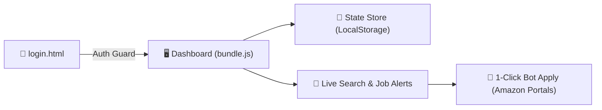

# 📦 Amazon Shift Automation & Unified Client System

[](https://developer.mozilla.org/en-US/docs/Web/JavaScript)
[](https://developer.mozilla.org/en-US/docs/Web/CSS)
[]()
[]()

> **Amazon Warehouse Shift Booking Automation, Candidate Management & Live Scanner System.**  
> એકદમ હળવું (Zero external dependencies) અને અતિ ઝડપી વેબ એપ્લિકેશન જે ક્લાયન્ટ અને સર્વર બંને રીતે ચાલે છે.

---

## 🚀 ઝડપી શરૂઆત (Quick Start)

### રીત ૧: Node.js સર્વર સાથે (Recommended)
```bash
npm start
```
👉 બ્રાઉઝરમાં આપોઆપ શરૂ થશે: **`http://localhost:3000/login.html`**

### રીત ૨: સીધું બ્રાઉઝરમાં ખોલો (Direct Browser)
- રૂટ પર રહેલા [**`index.html`**](index.html) અથવા [`frontend/login.html`](frontend/login.html) પર ડબલ-ક્લિક કરો.

---

## 🔑 ટેસ્ટિંગ લોગિન ક્રેડેન્શિયલ્સ (Login Credentials)

| રોલ (Role) | ઈમેલ (Email) | પાસવર્ડ (Password) | અધિકાર (Access Level) |
|---|---|---|---|
| **Super Admin** | `admin2003@gmail.com` | `admin2003` / `password123` | આખી સિસ્ટમ, તમામ એડમિન અને ઉમેદવારો પર પૂર્ણ નિયંત્રણ |
| **Operator** | `operator@amazon.com` | `password123` | ફક્ત પોતાના ઉમેરેલા ઉમેદવારો જ જોઈ શકે |
| **Candidate** | `vishantsutaria4@gmail.com` | `password123` | ફક્ત પોતાનું શિફ્ટ સ્ટેટસ જોઈ શકે |

---

## 📂 પ્રોજેક્ટ ફોલ્ડર માળખું (Clean Project Structure)

```text
Amazon-Hiring/
│
├── 🎨 frontend/                     # [FRONTEND] યુઝર ઇન્ટરફેસ અને ક્લાયન્ટ પેજીસ
│   ├── index.html                   # મુખ્ય ડેશબોર્ડ શેલ
│   ├── login.html                   # 3D સાયબરપંક એનિમેટેડ લોગિન પોર્ટલ
│   ├── css/
│   │   └── styles.css               # ગ્લાસમોર્ફિઝમ ડિઝાઇન સિસ્ટમ (~49 KB)
│   └── js/
│       ├── bundle.js                # ⭐️ મુખ્ય પ્રોડક્શન બંડલ (UI + બોટ + ઓટોમેશન)
│       └── modules/                 # 🧩 સોર્સ મોડ્યુલ્સ
│           ├── app.js               # ક્લાયન્ટ રાઉટર અને સેશન ગાર્ડ
│           ├── dashboard.js         # ડેશબોર્ડ સ્ક્રીન્સ અને મોડલ્સ
│           └── scanner.js           # Amazon Schedule ID સ્કેનર
│
├── ⚙️ backend/                      # [BACKEND] સર્વર, સ્ટેટ સ્ટોર અને ઓટોમેશન એન્જિન
│   ├── server.js                    # Node.js સર્વર & REST APIs (/api/health, /api/status)
│   ├── state.js                     # સેન્ટ્રલ સ્ટેટ સ્ટોર (LocalStorage & RBAC)
│   ├── mockWorker.js                # બેકગ્રાઉન્ડ સિમ્યુલેશન વર્કર (IMAP OTP & Booking)
│   └── package.json                 # બેકએન્ડ કન્ફિગરેશન
│
├── 📄 index.html                    # રૂટ ક્લિક પોઇન્ટ (frontend/login.html ખોલે છે)
├── 📄 package.json                  # npm start સ્ક્રિપ્ટ્સ
├── 📄 README.md                     # ⭐️ આ સિંગલ માસ્ટર ગાઈડ ફાઇલ
└── 📄 .gitignore                    # ગિટ સુરક્ષા નિયમો
```

---

## ⚡ મુખ્ય વિશેષતાઓ (Key Features)

1. **📡 Live Amazon Hiring Feed:**
   - કેનેડા (`hiring.amazon.ca`) અને US (`hiring.amazon.com`) ની લાઈવ શિફ્ટ્સ.
   - Smart Shift Recovery: "Job doesn't exist" ની એરર ન આવે તે માટે સીધી લાઈવ વેરહાઉસ લિંક્સ (`YYZ4`, `YYC1`, `PHX7`, વગેરે).

2. **🔔 Job Alerts & Hiring Predictions:**
   - ઉમેદવાર મુજબ ચોક્કસ વેરહાઉસ મોનિટરિંગ (Warehouse Watch List).
   - ૧૪ દિવસ અગાઉથી હાયરિંગ ઓપનિંગ્સ માટે ઓટોમેટિક એલર્ટ (દર ૫ મિનિટે બેકગ્રાઉન્ડ ચેક).

3. **🤖 1-Click Bot Modal & Auto-Fill:**
   - ઉમેદવારના ડેટા (Job ID, Schedule ID, Passwords) સાથે ૧-ક્લિકમાં ઓટો-ફિલ.
   - Canada / USA કન્ટ્રી સ્વિચર જેથી કોઈ ક્રોસ-બોર્ડર વોર્નિંગ ન આવે.

4. **👥 Hierarchical Security (RBAC):**
   - સુપર એડમિન, એડમિન અને ઓપરેટર્સ વચ્ચે કડક ડેટા સુરક્ષા; ઓપરેટરો એકબીજાના ઉમેદવારો જોઈ શકતા નથી.

5. **🔍 Schedule ID Scanner & OTP Tool:**
   - `SCH-CA-XXXXXX` શિફ્ટ આઈડી સ્કેનિંગ અને 2FA / IMAP OTP હેન્ડલિંગ.

6. **🛡️ 1-Hour Inactivity Guard:**
   - ૧ કલાક સુધી કોઈ પ્રવૃત્તિ ન થાય તો આપોઆપ સુરક્ષિત લોગઆઉટ.

---

## 🔄 સિસ્ટમ વર્કફ્લો (Runtime Data Flow)



---

## 📋 સેશન અને પ્રોજેક્ટ સ્ટેટસ (Session Status)

- [x] Background Auto-Alert Monitor (`runJobAlertCheck`) સક્રિય.
- [x] Bot Modal Facility fallback ફિક્સ લાગુ.
- [x] કેશ બસ્ટર `bundle.js?v=61.0` અપડેટ.
- [x] ફ્રન્ટએન્ડ અને બેકએન્ડનું આર્કિટેક્ચરલ વિભાજન પૂર્ણ.
- [x] નેટિવ Node.js બેકએન્ડ સર્વર (`backend/server.js`) સક્રિય.
- [x] ગિટહબ રિપોઝિટરી [**TanishkSudani/Amazon-Hiring**](https://github.com/TanishkSudani/Amazon-Hiring) સાથે સંપૂર્ણ સિંક.

---

## 📄 License
Proprietary — Developed for Amazon Shift Booking Automation & Client Control.
